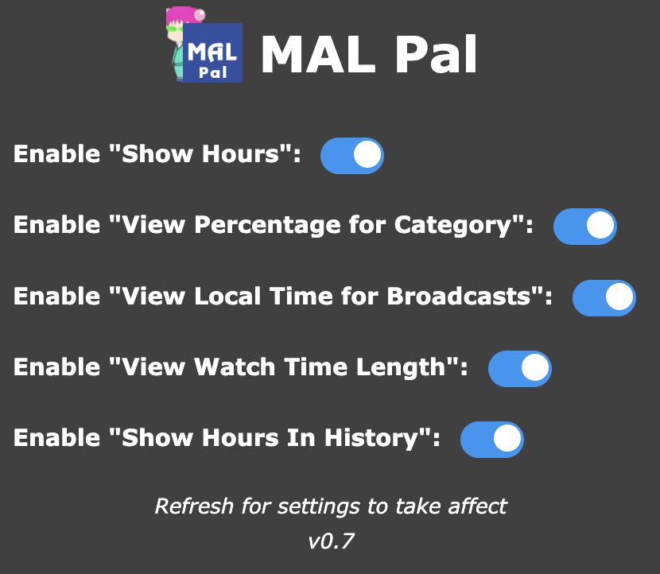

# 
 MAL Pal

**A Chromium and Firefox extension to enhance your MyAnimeList experience.**

MAL Pal adds new features to MyAnimeList to make browsing easier and more convenient! Giving you the option to view how many hours a user has spent consuming the medium, view broadcasting time in your time, see how long it will take to finish a season, and more!

## Features
* **Show hours spent watching or reading:** See the total number of hours a user has spent watching anime or reading manga right on their profile! Now you can enjoy your degeneracy in a new time format ;)
* **Localized Broadcasting Times:** View an anime's broadcasting time in your own local time zone. Don't worry about any time conversions ever again!
* **Time to Finish:** Quickly see how long it will take to complete an anime, based on its episode count and length. Plan your watch schedule with ease.
* **Toggable Settings:** Easily toggle every setting with the simple to use pop-up whenever you need to make any changes.

## Installation

#### Option 1: Install from Chrome Web Store or from Firefox Add-ons
1. Download the extension from the [Chrome Web Store](https://chromewebstore.google.com/detail/jegmpjgnklkpcgdbadphgnelkcdfdpob/) (currently under review, so not ready at this time) or from [Firefox Add-ons](https://addons.mozilla.org/en-US/firefox/addon/mal-pal/) (currently under review, so not ready at this time)
2. Click "Add to Chrome" or "Add to Firefox"
3. Enjoy your new enhanced MAL experience!

#### Option 2: Installing from Source Code
1. Download the project as a ZIP, and unzip the project files in any location you desire
2. Next steps vary between browser options
	* For Chrome: Run `build.sh` and build for chromium and use that folder, or move the manifest file under `platform/chromium/manifest.json` to the root folder. Then go to your browser's extension page and enable "Developer Mode". Finally select the "Load Unpacked" button and choose the project folder
	* For Firefox **(Note: you can only temporary save the extension at this time)**: Run `build.sh` and build for firefox and use that zip file, or move the manifest file under `platform/firefox/manifest.json` to the root folder. (*If you didn't build project, then next zip the CONTENTS, not the parent folder, to a zip file.*) On the extensions page, click the settings icon and select "Debug Add-ons". Finally choose "Load Temporary Add-on" and select your zipped folder to load TEMPORARILY
4. Enjoy your new enhanced MAL experience!

## Usage
Once installed, MAL Pal will automatically integrate with MAL with the settings you enable. You'll see the new features displayed on relevant pages.

* **Show hours spent watching or reading:** The hours will show up next to the "Days" stats for both anime and manga.
* **Localized Broadcasting Times:** This will appear on the Information panel on the left side of the anime's page.
* **Time to Finish:** New text will appear right beside the episode tracker on an anime's page that displays how long in hours and minutes it will take to finish the show.

## Extension preview
*Preview of the pop-up as of v0.7*

## Contributing
Contributions are welcome! Feel free to submit bug reports, feature requests, or pull requests.

## License
This project is licensed under the MIT License - see the [LICENSE.md](LICENSE.md) file for details.
